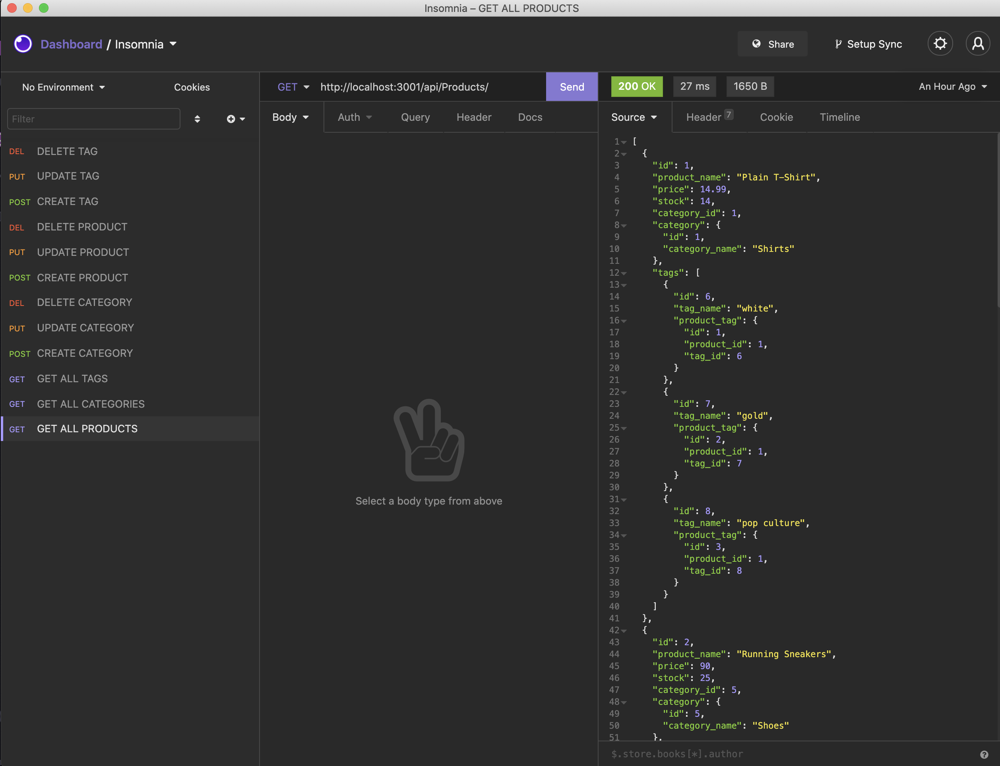
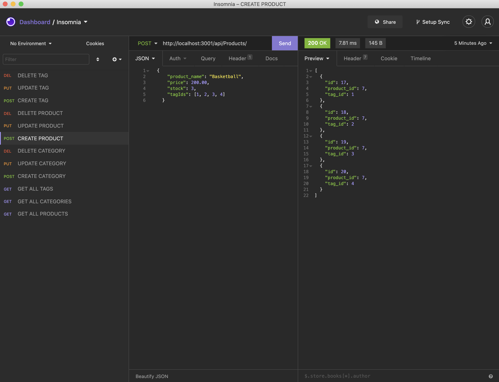
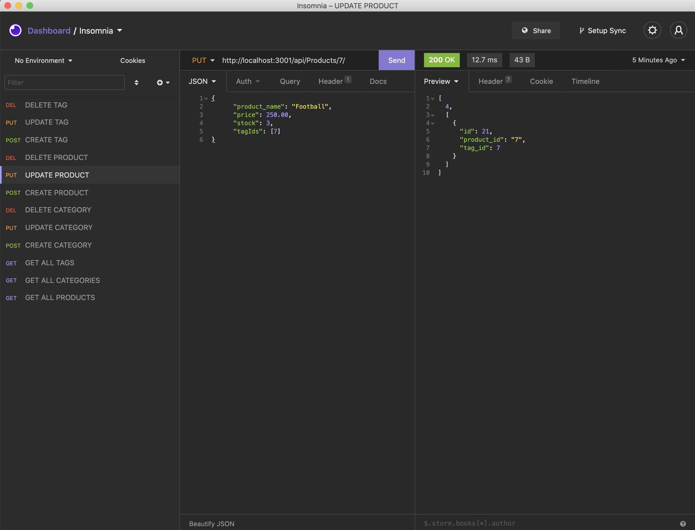
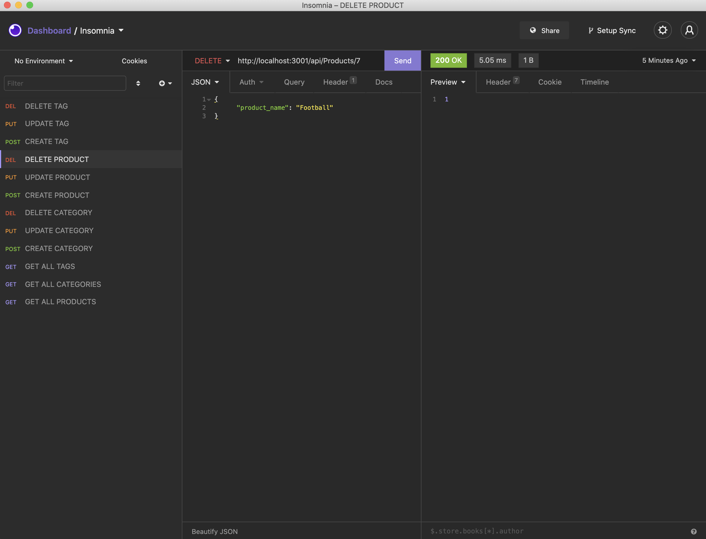

# E-Commerce-Back-End

Back end e-commerce that uses Express.js API and MySQL database

## Goal:

As the size and popularity of E-commerce platforms like Shopify and WooCommerce grow, it is important to understanding the fundamental architecture of these platforms as a full-stack web developer.

When provided with an exisiting E-commerce platform, the goal was to test the database using Insomnia and apply the 'CRUD' principles (CREATE, READ, UPDATE and DELETE) to verify the usability and accuracy of the code.

## Results:

I was successful in using the seeds in MYSQL to properly execute the CRUD actions and test it in Insomnia. The screen shots below show examples using the 'products' from the e-commerce site.

### GET ALL

### CREATE

### UPDATE

### DELETE

---

## Finished E-Commerce-Back-End Video:

https://drive.google.com/file/d/1JZr-jFLl2kOZ81h3vuk3uuAMAtZgu2jE/view?usp=sharing

### Github Link:

https://github.com/sbgastondesign/E-Commerce-Back-End

### License

MIT License, Copyright (c) [2021] [StephanieGaston]

---

### Contact:

- Email: sbgastondesign@gmail.com
- Github: github.com/sbgastondesign
- LinkedIn: "http://www.linkedin.com/stephanie-gaston-1067217a/"
